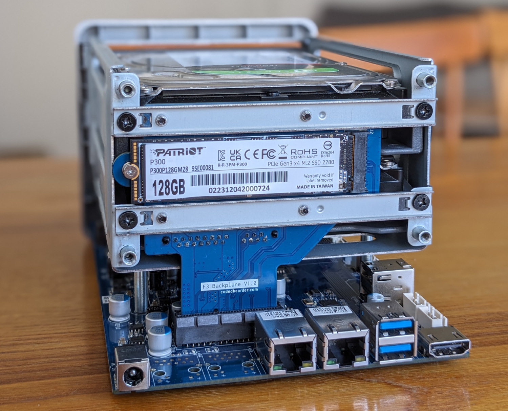
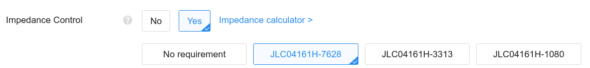
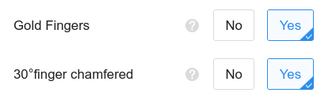

# F3 Backplane

> F2 + 1 = F3, right?

This is a custom backplane PCB for Terramaster F2-221, which adds a socket for an NVMe SSD for booting an operating system from.

Blog post about creating this: https://codedbearder.com/posts/f3-backplane/

## Ordering from JLCPCB

The gerber zip file can be found under `fab/v1.0/f3_backplane.zip` and is generated for JLCPCB. When ordering the PCB make sure to select impedance controlled stackup ***JLC04161H-7628***.

Also, make sure to select ***Gold Fingers*** and ***30°finger chamfered***. It will recommend selecting an ENIG surface finish in order to get them _actually_ gold plated, but as this is more expensive and the backplane _shouldn't_ get removed and inserted into the motherboard often I just went with the standard HASL (with lead) surface finish and I haven't had any problems.

[Bill of materials](./f3_backplane.csv)
